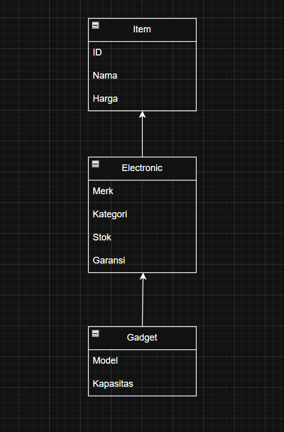

# TP2DPBO2425C2 

Saya Niha April Miani dengan NIM 2402567 mengerjakan Tugas Praktikum 2 dalam mata kuliah Desain Pemogramana Berorientasi Objek untuk keberkahanNya maka saya tidak melakukan kecurangan seperti yang telah dispesifikasikan. Aamiin

Untuk membuat program lebih terstruktur dibuatlah tiga kelas.
Kelas Item menjadi kelas dasar yang menyimpan atribut umum seperti id, nama, dan harga. Lalu ada kelas Electronic yang mewarisi dari Item dan menambahkan atribut lebih spesifik seperti merek, kategori, stok, dan garansi. Terakhir ada kelas Gadget yang mewarisi semuanya dan menambahkan atribut khusus seperti model dan kapasitas baterai. Dengan desain ini, program menjadi lebih rapi, mudah dibaca, dan fleksibel kalau nantinya ingin menambah produk elektronik lain.

## Diagram ##

