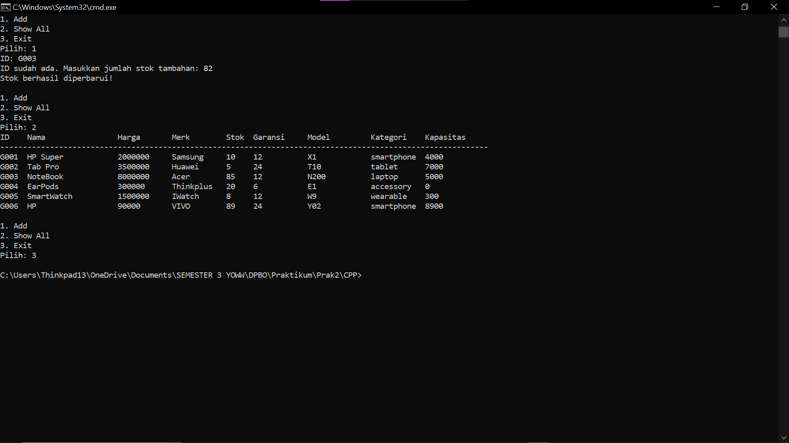

# TP2DPBO2425C2 

Saya Niha April Miani dengan NIM 2402567 mengerjakan Tugas Praktikum 2 dalam mata kuliah Desain Pemogramana Berorientasi Objek untuk keberkahanNya maka saya tidak melakukan kecurangan seperti yang telah dispesifikasikan. Aamiin

Untuk membuat program lebih terstruktur dibuatlah tiga kelas.
Kelas Item menjadi kelas dasar yang menyimpan atribut umum seperti id, nama, dan harga. Lalu ada kelas Electronic yang mewarisi dari Item dan menambahkan atribut lebih spesifik seperti merek, kategori, stok, dan garansi. Terakhir ada kelas Gadget yang mewarisi semuanya dan menambahkan atribut khusus seperti model dan kapasitas baterai. Dengan desain ini, program menjadi lebih rapi, mudah dibaca, dan fleksibel kalau nantinya ingin menambah produk elektronik lain.

## Diagram ##

Item
Atribut: id, nama, harga
Method: constructor untuk inisialisasi data, getter untuk ambil data
Electronic (extends Item)
Atribut tambahan: merek, kategori, stok, garansi
Method: constructor yang juga memanggil constructor Item, getter tambahan
Gadget (extends Electronic)
Atribut tambahan: model, kapasitasBaterai
Method: constructor yang memanggil constructor Electronic, getter untuk ambil semua data

Alur programnya
Program dimulai dengan pembuatan beberapa data awal berupa objek Gadget yang sudah diisi nilai default.
Pengguna dapat menambahkan data baru secara manual.
Saat menambahkan data, program melakukan pengecekan ID terlebih dahulu:
- Jika ID sudah ada, maka program hanya menambah jumlah stok.
- ika ID belum ada, maka dibuat objek Gadget baru yang ditambahkan ke daftar produk.
Semua data, baik data awal maupun data dari input pengguna, ditampilkan dalam bentuk tabel dinamis.
Setiap atribut menjadi kolom.
Setiap baris merepresentasikan satu produk Gadget.
Secara sederhana, desain ini menggambarkan bagaimana sebuah toko elektronik bisa dikelola secara digital.

Item = representasi umum barang.
Electronic = menambahkan informasi detail barang elektronik.
Gadget = menambahkan spesifikasi lebih khusus.

## CPP ##
- Tambah produk

- Menambah jumlas stok

## JAVA ##
- Tambah produk

- Menambah jumlah stok

## Python ##
- Tambah produk

- Menambah jumlah stok

## PHP ##
- Menu Add

- tampilan sebelum di tambahkan

- Berhasil di tambahkan

